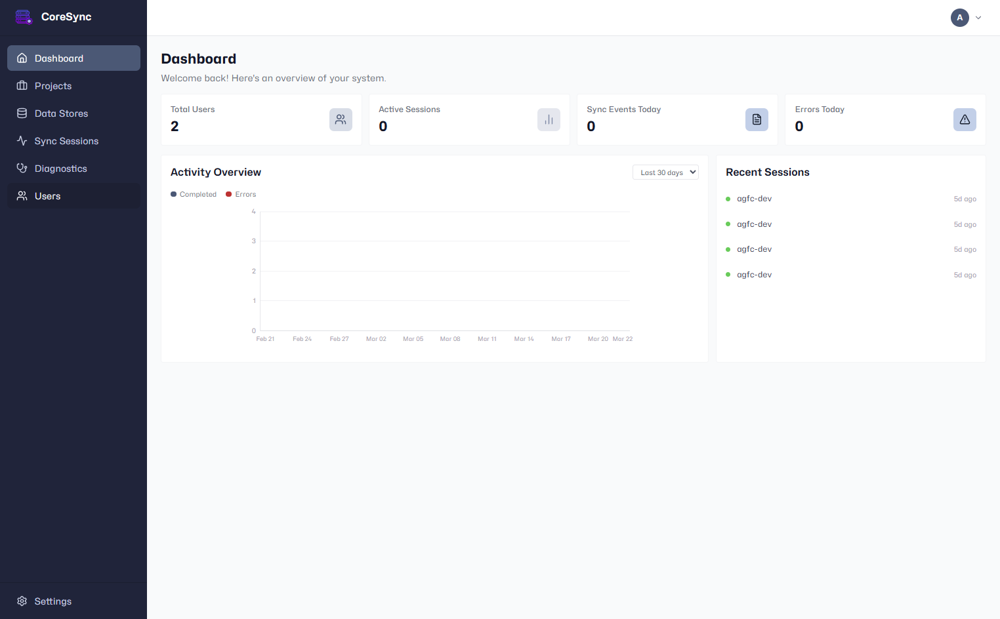
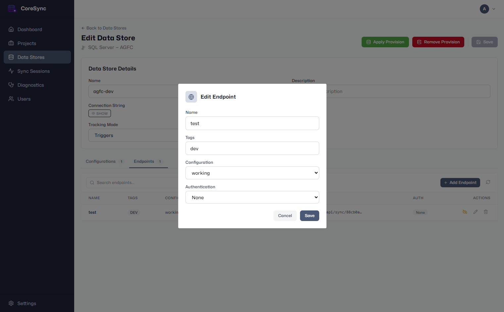

# CoreSyncServer

A self-hosted server and management dashboard for administrating database synchronizations powered by [CoreSync](https://github.com/adospace/CoreSync).

CoreSyncServer gives you a web-based control plane to configure, monitor, and secure bidirectional sync between your application databases — without writing sync infrastructure code.

## Features

- **Multi-database support** — synchronize SQLite, SQL Server (Triggers or Change Tracking), and PostgreSQL databases.
- **Web dashboard** — manage projects, data stores, table configurations, and endpoints from an intuitive web UI.
- **Per-endpoint authentication** — protect sync endpoints with Basic, API Key, or JWT/JWKS authentication.
- **Claim-based filtering** — pass authenticated user claims as query parameters to filter synced data per user or tenant.
- **Bulk streaming** — efficient paginated change set transfers with JSON and MessagePack binary support.
- **Connectivity monitoring** — background health checks on configured data stores with optional email alerts.
- **Automatic maintenance** — scheduled cleanup of sync sessions, traces, and diagnostics.

## Dashboard

<!-- TODO: Replace with actual screenshots -->


*Project and data store overview.*


*Configuring a sync endpoint with authentication.*

## How It Works

```
┌─────────────┐         ┌──────────────────┐         ┌─────────────┐
│  Client App  │◄──────►│  CoreSyncServer   │◄──────►│  Database    │
│  (mobile,    │  HTTP   │  (API + Dashboard)│         │  (SQLite,   │
│   desktop,   │  sync   │                  │         │   SQL Server,│
│   web, API)  │         │                  │         │   PostgreSQL)│
└─────────────┘         └──────────────────┘         └─────────────┘
```

1. **Configure** — use the dashboard to create a project, connect a data store, select which tables to sync, and publish an endpoint.
2. **Authenticate** — each endpoint can require Basic, API Key, or JWT credentials.
3. **Sync** — client applications call the REST API from any platform or language to pull and push change sets.

## Quick Start

CoreSyncServer is distributed as a Docker image with a bundled PostgreSQL database for its own metadata storage.

```bash
git clone --recurse-submodules https://github.com/adospace/CoreSyncServer.git
cd CoreSyncServer/deploy
cp .env.example .env
# Edit .env and set a strong POSTGRES_PASSWORD
docker compose up -d
```

Open **http://localhost:8080** and log in with `admin` / `admin`.

For the full installation guide — including HTTPS, SMTP notifications, reverse proxy setup, backup/restore, and troubleshooting — see the [Deployment Guide](deploy/README.md).

## Sync API at a Glance

All sync endpoints live under `api/sync/{endpointId}`:

| Operation | Method | Path |
|---|---|---|
| Get store ID | `GET` | `store-id` |
| Get sync version | `GET` | `sync-version` |
| Download changes | `GET` | `changes-bulk/{storeId}` |
| Upload changes | `POST` | `changes-bulk-begin` → `changes-bulk-item` → `changes-bulk-complete/{sessionId}` |

See the [Deployment Guide — Sync API Reference](deploy/README.md#sync-api-reference) for the complete endpoint list with authentication headers and curl examples.

## Supported Databases

| Database | Tracking Modes | Notes |
|---|---|---|
| **SQLite** | Trigger-based | File path must be accessible from the server |
| **SQL Server** | Triggers, Change Tracking | Choose per data store |
| **PostgreSQL** | Trigger-based | Full support |

## Technology

- PostgreSQL for application metadata
- [CoreSync](https://github.com/adospace/CoreSync) for the sync engine
- Standard REST API — works with any language or framework (React, Flutter, Node.js, Python, Go, etc.)

## License

[MIT](LICENSE) — Copyright (c) 2026 Adolfo Marinucci
